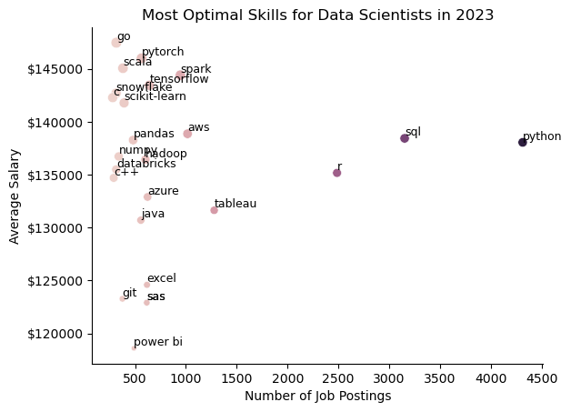

# WIP:  about half-done with this readME.  The scripts are done.
# Introduction

This project is an examination of the market for populat data roles in the year 2023 conducted using SQL, done for the purpose of gaining valuable and practical experience in SQL queries.  You can view these queries in the [project_queries](/project_queries/) folder.

# Background

This project was part of Luke Barrousse's SQL course, and the data used is hosted by that course.  This project offers valuable insights into the most demanded and highest-paying skills in the data job market.  I recently completed a similar project entirely in Python, but conducted this very similar analysis using SQL queries in order to gain experience.  The goal of this project was to answer the following questions:

1.  What are the top-paying jobs in the three most common data roles? (Data Analyst, Data Scientist, Data Engineer)
2.  What skills are required by the top-paying Data Analyst jobs?
3.  What skills are most in-demand for the top three roles?
4.  Which skills are associated with the highest average salaries?
5.  What are the optimal skills to learn?

# Tools I Used
- ### SQL
    - Allowed me to query this large dataset to gain insights.
- ### PostgreSQL
    - The database management tool of choice for this project, chosen because it was the most demanded specific database in data job postings.
- ### Visual Studio Code
    - Code editor used to write and execute SQL queries and collect files into this repo.
- ### Git/Github
    - Version control system used to share this project including scripts, analysis, and supporting visuals.
- ### Python/Jupyter Notebooks
    - Used for supporting visuals in project queries.
    - The notebook can be viewed [here](/project_visualizations.ipynb) but cannot be reproduced, as it depends on .csv files extracted from SQL results.  Those .csv files are much too large for Github.

# The Analysis

Each query provided here aims to answer one of the five major questions about the data jobs market.  While the data is from 2023 and may be slightly dated, the insights might still apply in 2025 and beyond.  I limited my search to remote or local jobs for the first two questions, then examined the entire market for the last three.

## 1.  What are the top-paying jobs across the three highest-paying roles?

To answer this question, I ran a query using the core job postings table and the company info table, first collecting all the rows that fit my criteria and then sorting by salary in descending order.  The specific job postings don't matter as they've surely been filled by now, but the key takeaway is that some companies looking for data experts are willing to pay well over $200,000 per year for them.  The query can be viewed [here](/project_queries/1_top_paying_jobs.sql)

## 2.  What skills are required by the top-paying Data Analyst jobs?

To answer this question, I joined all four tables and used a CTE to get the top 10 local or remote Data Analyst roles.  Only 8 of these roles listed their required skills, so I graphed how frequently those skills appeared in the sample.  One job posted by AT&T listed 13 skills, though some of those were specific Python libraries.  The query can be seen [here](/project_queries/2_top_paying_job_skills.sql)

Of the 8 skills that appear on this chart, I've now learned six.  SQL and Python are demanded in 7 of the 8 postings.

## 3.  What are the most-demanded skills among the top three roles?

For this question, I used the GROUP BY statement to count job postings demanding a given skill.  The full query can be seen [here](project_queries/3_most_in_demand_skills.sql)

This query returned the top 5 most demanded skills for each of the three major roles.

### Data Analysts

| Skill       | Job Postings|
| ----------- | ----------- |
| SQL         | 92628       |
| Excel       | 67031       |
| Python      | 57326       |
| Tableau     | 46554       |
| Power BI    | 39468       |

### Data Scientists

| Skill       | Job Postings|
| ----------- | ----------- |
| Python      | 114016      |
| SQL         | 79174       |
| R           | 59754       |
| SAS         | 29642       |
| Tableau     | 29513       |

### Data Engineers

| Skill       | Job Postings|
| ----------- | ----------- |
| SQL         | 113375      |
| Python      | 108265      |
| AWS         | 62174       |
| Azure       | 60823       |
| Spark       | 53789       |

SQL appears no lower than 2nd on any of these tables, and Python no lower than 3rd.  After those two, we see more specialization by job title.  Data analysts are asked to know visualization tools like Tableau and Power BI, as well as the always popular Excel.  Data scientists are asked to know other data analytics languages like R and SAS.  Finally, data engineers are asked to know cloud platforms and other database tools like AWS, Azure, and Spark.

## 4.   Which skills are associated with the highest average salaries?

The query for this question can be seen [here](project_queries/4_top_skills_by_salary.sql) These are the skills with the highest average salaries across all three major roles.

While these are high numbers, there is only so much we can learn from sample sizes this small.  No skill in any of these charts has more than 900 postings.  However, we do see that these are highly specialized skills.  There are many different cloud technologies and machine learning tools in these highly-paid skills.

## 5.  What are the optimal skills to learn?

Finally, we run one last query to decide what are the most optimal skills to learn, looking at both demand and salary.  The query can be seen [here](project_queries/5_most_optimal_skills.sql)

These are the top 5 most optimal skills to learn for each role, sorted by number of postings.

### Data Analysts

| Skill       | Job Postings| Average Salary|
| ----------- | ----------- | --------------|
| SQL         | 3083        | 96435         |
| Excel       | 2143        | 86419         |
| Python      | 1840        | 101512        |
| Tableau     | 1659        | 97978         |
| R           | 1073        | 98708         |

### Data Scientists

| Skill       | Job Postings| Average Salary|
| ----------- | ----------- | --------------|
| Python      | 4312        | 138049        |
| SQL         | 3151        | 138430        |
| R           | 2486        | 135165        |
| Tableau     | 1278        | 131636        |
| AWS         | 1016        | 138861        |

### Data Engineers

| Skill       | Job Postings| Average Salary|
| ----------- | ----------- | --------------|
| SQL         | 3189        | 128461        |
| Python      | 3041        | 132107        |
| AWS         | 2000        | 134072        |
| Spark       | 1587        | 136136        |
| Azure       | 1459        | 129152        |

These are results we can learn from.  For example, we can see that companies value Excel less than other skill for data analysts, probably because of how common it is.  We see less stratification in data scientists and engineers, at least among the top 5 most demanded skills.  For further investigation, I made these scatterplots:

# What I Learned

For data scientists and data analysts, SQL stands out as a skill that is both highly desired and highly profitable.  It is also highly demanded for data engineers, although it is less highly paid.  In the top left quadrant of all these graphs, we see skills that are more niche but very well-paid.  Many of these are cloud technologies or databases.  The two most optimal skills to learn seem to be Python and SQL, across all three roles.  Following that would be a pure visualization tool like Tableau, and R, which handles data analysis in a similar manner to Python.

# Conclusions

Taking the time to practice and refine skills in SQL has improved my career prospects in the data fields.  A resume with SQL and Python on it, and publicly hosted projects to serve as a work sample, will be more helpful to me than knowing R, Tableau, and Excel alone.